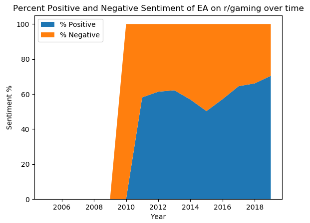
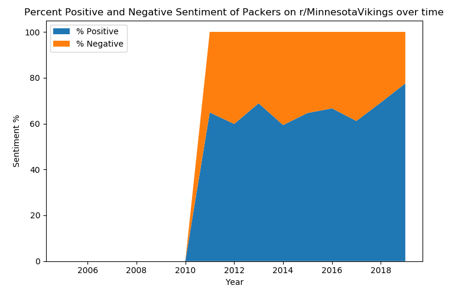
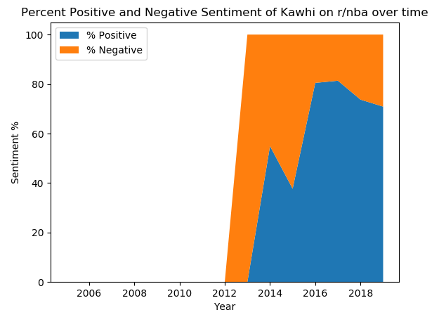

# sentimentograph
Sentiment analysis pyplot graphs of a topic on subreddit over time
# TODO
Some refining needs to be done. The following results paint an incomplete picture of the topic in the context of their subreddits.

Doesn't make sense as EA is notorious for microtransactions and lootboxes.

Minnesota Vikings fans have an intense hatred for their divisional rivals, the Green Bay Packers.

I would find it hard to believe Kawhi Leonard had that much negative sentiment directed towards him given how good his first couple seasons were.
